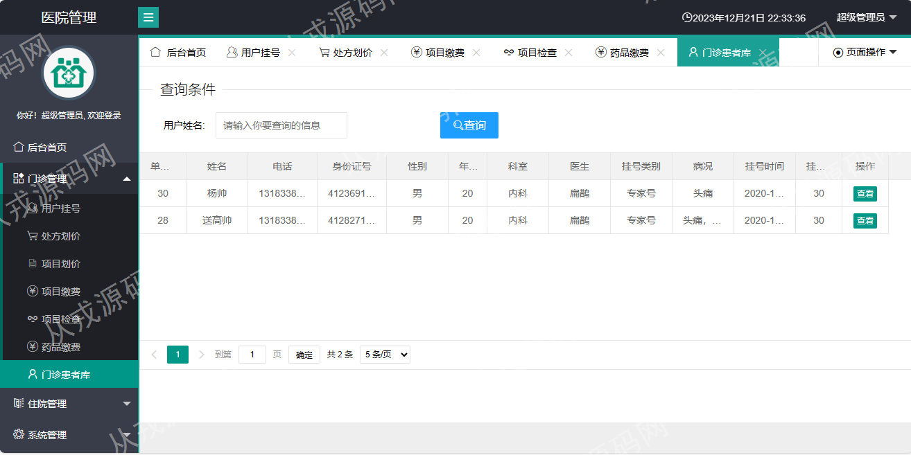

<h1 align="center">69.医院管理系统</h1>

- <b>完整代码获取地址：从戎源码网 ([https://armycodes.com/](https://armycodes.com/))</b>
- <b>技术探讨、资料分享，请加QQ群：692619798</b> 
- <b>作者微信：19941326836  QQ：952045282</b> 
- <b>承接计算机毕业设计、Java毕业设计、Python毕业设计、深度学习、机器学习</b>
- <b>选题+开题报告+任务书+程序定制+安装调试+论文+答辩ppt 一条龙服务</b>
- <b>所有选题地址 ([https://github.com/YuLin-Coder/AllProjectCatalog](https://github.com/YuLin-Coder/AllProjectCatalog)) </b>

## 项目介绍
基于springboot的医院管理系统：前端jquery、layui，后端 maven、springmvc、spring、mybatis，集成门诊管理、住院管理、统计管理、排班管理、仓库管理、药房管理等功能于一体的系统。

## 功能介绍

### 管理员

- 后台首页：就诊概况，住院概况，排班信息
- 门诊管理：用户挂号，处方划价，项目划价，项目缴费，项目检查，药品缴费，门诊患者库
- 住院管理：入院登记，缴费管理，药品记账，项目记账，出院结算
- 系统管理：菜单管理，角色管理，用户管理，图标管理，数据源监控
- 统计管理：门诊月度统计，住院月度统计，门诊年度统计，住院年度统计，医生统计对比，门诊当天统计
- 数据中心：科室中心，医生列表，药品产地，项目大类，挂号类型，仓库，经办人，计量单位，供货商，药品分类，药品字典
- 排班管理：医生排班
- 仓库管理：入库单，库存查询，出库单，库存不足，过期提醒，操作记录，药品回收
- 药房管理：药房详情，门诊取药，住院取药

### 门诊

- 后台首页：就诊概况，住院概况，排班信息
- 门诊管理：用户挂号，处方划价，项目划价，项目缴费，项目检查，药品缴费，门诊患者库

## 环境

- <b>IntelliJ IDEA 2021.3</b>

- <b>Mysql 5.7.26</b>

- <b>JDK 1.8</b>

## 运行截图

